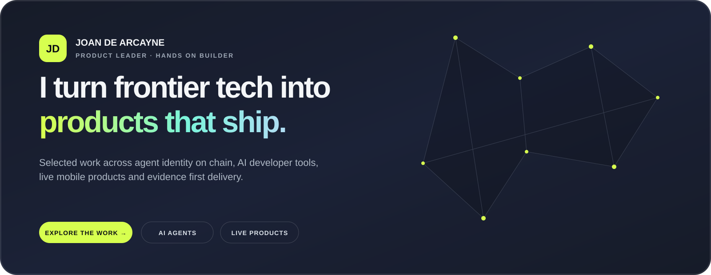

  

<h1 align="center">Joan De Arcayne</h1>

<strong>Product leader and hands on builder working across AI agents, crypto infrastructure and developer products.</strong>

  <a href="https://arcayne.github.io/arcayne/"><strong>Explore the interactive project showcase →</strong></a>

I work closest to the problems where product strategy, technical judgment and delivery ownership need to stay in the same loop. The projects below show how I turn emerging technology into products that people and developers can actually use.

## Selected public work

### [Injective Agent Identity Stack](https://github.com/InjectiveLabs/injective-agent-sdk)

Developer tools that give AI agents a verifiable identity on Injective. Builders can register an agent, attach its wallet and public profile, and make its services and reputation discoverable.

**My role:** Product direction and hands on implementation across the SDK, CLI, agent profiles, wallet linking and discovery experience.

### [Injective MCP Identity Tools](https://github.com/InjectiveLabs/mcp-server/pull/11)

A set of tools that lets AI assistants create, find and manage Injective agent identities directly from a conversation or automated workflow. It connects the identity system to Claude and other MCP compatible clients.

**My contribution:** Designed and built the identity and reputation integration. The public pull request contains eight tools and a branch test suite with 321 passing tests. **Status: under review.**

### Helix Market Launches

Hands on launch work that made new USDC grid trading markets available in Helix. I corrected market names, linked each market to the right contract on chain and updated the files used by production and staging.

**Public examples:** [market mapping update](https://github.com/InjectiveLabs/injective-lists/pull/402) · [seven new USDC markets](https://github.com/InjectiveLabs/injective-lists/pull/403)

### [Agentic Delivery Playbook](https://github.com/arcayne/agentic-delivery-playbook)

A practical playbook for using AI agents to deliver real product and engineering work safely. It helps teams choose the right level of control, verify the result and keep a clear record of what changed.

## Independent products

### [SafeReceipt](https://play.google.com/store/apps/details?id=com.safereceipt.app&pli=1)

A privacy focused Android app that keeps important receipts available for warranties, returns, expenses and insurance claims. Users can scan paper receipts or import PDFs, extract and search the important details, organize receipts, export them and back them up to their own Google Drive.

**My role:** Built and launched the product end to end, including mobile UX, OCR, local storage, backup, monetization and the Google Play release. The source repository is private.

### Knowledge Bits

An AI content production system that turns a brief and trusted sources into a complete package ready for review: research, written content, media, quality checks and final delivery. Every source and approval remains traceable.

**My role:** Product, architecture and implementation. Repository access is shared directly.

### Farming, Guarded Trading Copilot

A trading copilot that first observes and proposes actions, then requires human approval before it can execute. It is designed to make automation useful without giving an agent unchecked control over funds.

**My role:** Product, safety model and implementation. Repository access is available for a deeper review.

 

  <strong>Product judgment. Technical fluency. Delivery ownership.</strong>

